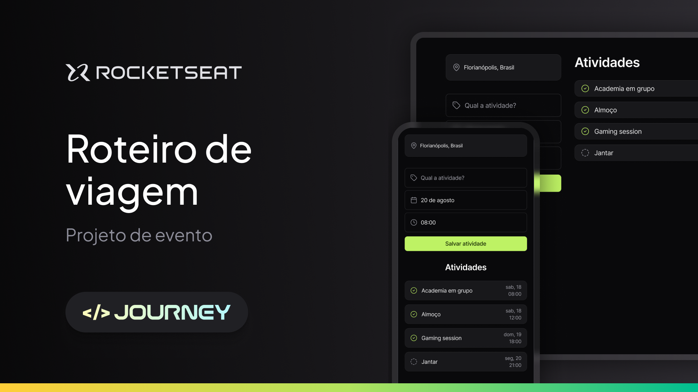

Aplicação desenvolvida no NLW Journey da Rocketseat na trilha HTML+CSS+JS.

  <a href="#-tecnologias">Tecnologias</a>&nbsp;&nbsp;&nbsp;|&nbsp;&nbsp;&nbsp;
  <a href="#-projeto">Projeto</a>&nbsp;&nbsp;&nbsp;|&nbsp;&nbsp;&nbsp;
  <a href="#memo-licença">Licença</a>

  

 

  

Acesse o projeto finalizado aqui: 
- [Acesse o projeto finalizado, online](https://leticiafuruse.github.io/nlw-viagens/)

## 🚀 Tecnologias

Esse projeto foi desenvolvido com as seguintes tecnologias:

- HTML
- CSS
- JavaScript

## Projeto

Nesse projeto foi desenvolvido uma versão simplificada de um sistema de roteiro de viagem!

